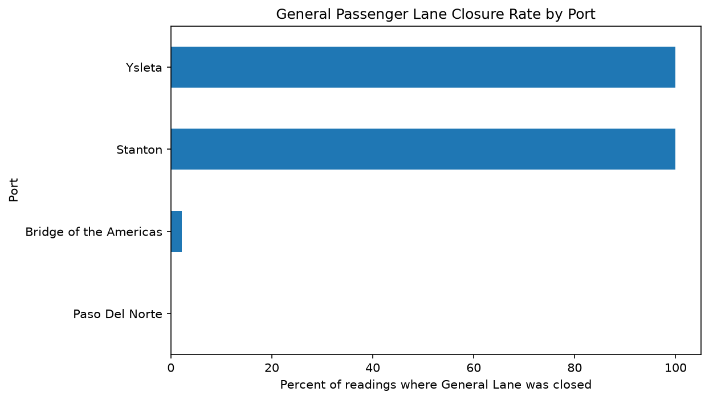
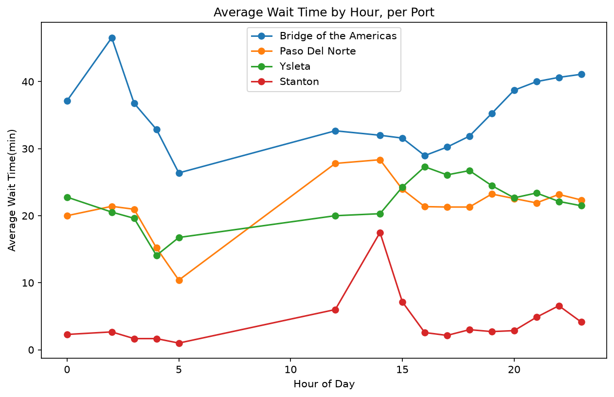
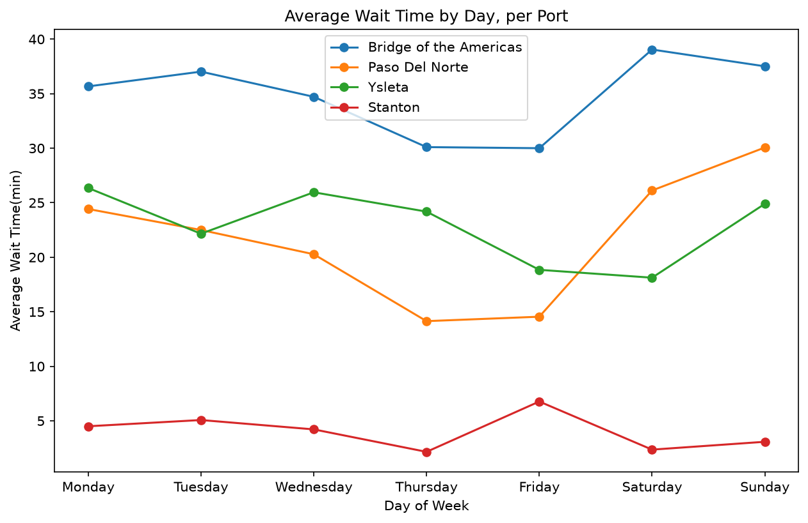

# Border Wait Time Analysis

An automated pipeline collecting live U.S. Customs and Border Protection wait-time
data across El Paso's four ports of entry, running unattended via GitHub Actions.

## What this is

A sister project to Fix El Paso: this repo scrapes CBP's live border wait-time
feeds hourly, accumulates a growing dataset with zero manual intervention, and
analyzes patterns in crossing times across El Paso's bridges. It doubles as
preliminary prep work for a proposed research collaboration with UTEP.

## Data source

Live RSS feeds from [bwt.cbp.gov](https://bwt.cbp.gov), covering:
- Bridge of the Americas (BOTA)
- Paso Del Norte (PDN)
- Ysleta
- Stanton DCL

Data is fetched hourly and covers Commercial, Passenger, and Pedestrian lane
categories, including General, Fast, Sentri, and Ready lane types.

## Findings

- **Fastest bridge:** Stanton — ~4 minute average wait
- **Slowest bridge:** Bridge of the Americas — ~35 minute average wait, over
  8x higher than Stanton
- **Hour-of-day pattern:** Bridge of the Americas is consistently the slowest
  crossing throughout the day, while Stanton is consistently fastest. Paso Del
  Norte and Ysleta cross paths around midday.
- **Day-of-week pattern:** Similar shape to the hourly pattern, with Ysleta and
  Paso Del Norte sometimes crossing throughout the week.
- **General lane closures:** At Stanton and Ysleta, the General passenger lane
  was closed in 100% of readings collected this week (93/93 at each port).
  Bridge of the Americas and Paso Del Norte almost never showed this. Possible
  explanations include these ports routing general traffic through alternate
  procedures not reflected in CBP's standard categories — worth investigating
  further.

## Data quality notes

- Hours 2-5 and 12 have fewer readings across all ports due to an early
  scraper bug (handling of CBP's "Pending" status), fixed August 15. Treat
  these hours as lower-confidence.
- Stanton has fewer readings than the other three ports throughout the week.

## How it works

- `scraper/collect.py` — fetches and parses the CBP feeds, handling four
  distinct data states (numeric readings, closed lanes, not-applicable lane
  types, and pending updates)
- `.github/workflows/scrape.yml` — runs the scraper hourly via GitHub
  Actions and commits new data automatically, with zero manual intervention
- `notebooks/exploratory_analysis.ipynb` — the analysis behind these findings
- `data/raw/wait_times.csv` — the accumulating dataset
